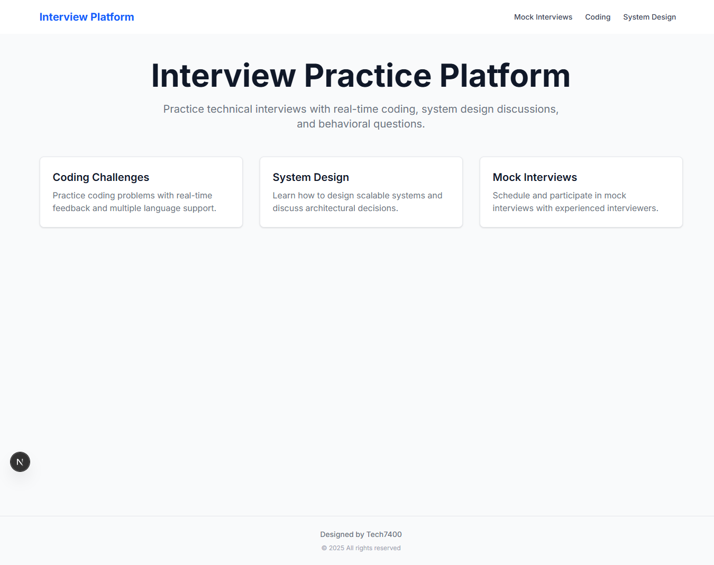

# 🧠 Interview Practice Platform

An advanced full-stack platform to practice **real-time technical interviews** — including live coding, system design, and mock interview scheduling — built with modern web technologies.



---

## 🚀 Features

- 🎥 **Video Interviews** via WebRTC (`simple-peer`)
- 💻 **Real-time Code Editor** using Monaco Editor
- 🔌 **Live Collaboration** with Socket.IO
- 🗓️ **Schedule Mock Interviews** with flexible time slots
- 🧱 **System Design Practice** with whiteboard-like questions
- ⚙️ Built with **Next.js**, **TypeScript**, **TailwindCSS**

---

## 🧩 Tech Stack

| Category           | Tech Used                           |
|--------------------|--------------------------------------|
| Frontend           | Next.js, TypeScript, TailwindCSS     |
| Code Editor        | Monaco Editor                        |
| Video Call         | WebRTC, simple-peer                  |
| Real-time Comm     | Socket.IO                            |
| State Management   | React Hooks, Context API             |
| Scheduling UI      | Custom Calendar & Time Components    |

---

## 📸 Screenshots

### 🏠 Home Page  


### 💻 Coding Challenge  


### 🧱 System Design  


---


## Getting Started

First, run the development server:

```bash
npm run dev
# or
yarn dev
# or
pnpm dev
# or
bun dev
```

Open [http://localhost:3000](http://localhost:3000) with your browser to see the result.

You can start editing the page by modifying `app/page.tsx`. The page auto-updates as you edit the file.

This project uses [`next/font`](https://nextjs.org/docs/app/building-your-application/optimizing/fonts) to automatically optimize and load [Geist](https://vercel.com/font), a new font family for Vercel.

## Learn More

To learn more about Next.js, take a look at the following resources:

- [Next.js Documentation](https://nextjs.org/docs) - learn about Next.js features and API.
- [Learn Next.js](https://nextjs.org/learn) - an interactive Next.js tutorial.

You can check out [the Next.js GitHub repository](https://github.com/vercel/next.js) - your feedback and contributions are welcome!

## Deploy on Vercel

The easiest way to deploy your Next.js app is to use the [Vercel Platform](https://vercel.com/new?utm_medium=default-template&filter=next.js&utm_source=create-next-app&utm_campaign=create-next-app-readme) from the creators of Next.js.

Check out our [Next.js deployment documentation](https://nextjs.org/docs/app/building-your-application/deploying) for more details.

```bash
git add README.md
git commit -m "Update README with full project details and screenshots"
git push origin master
