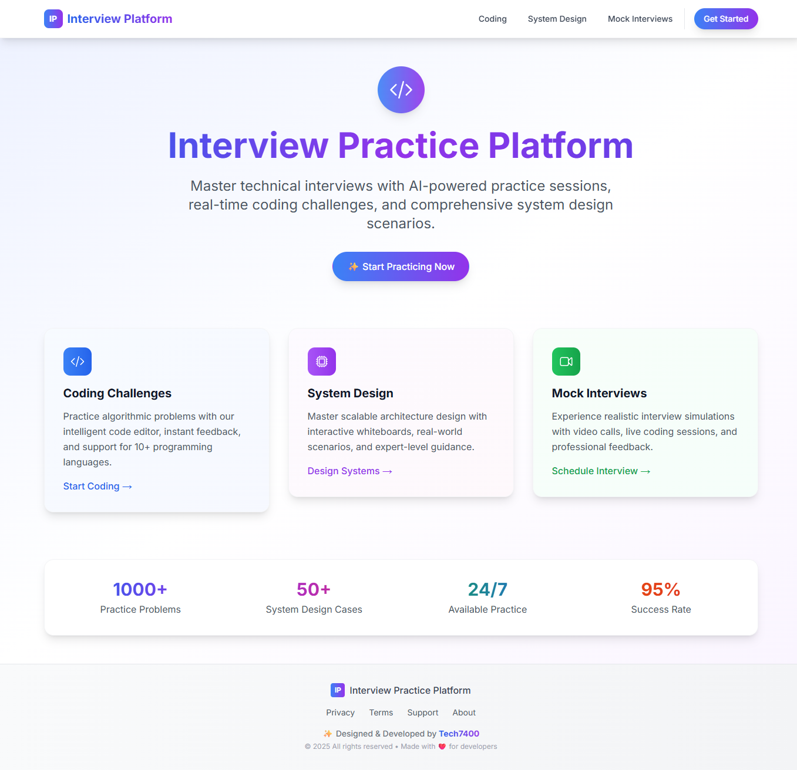
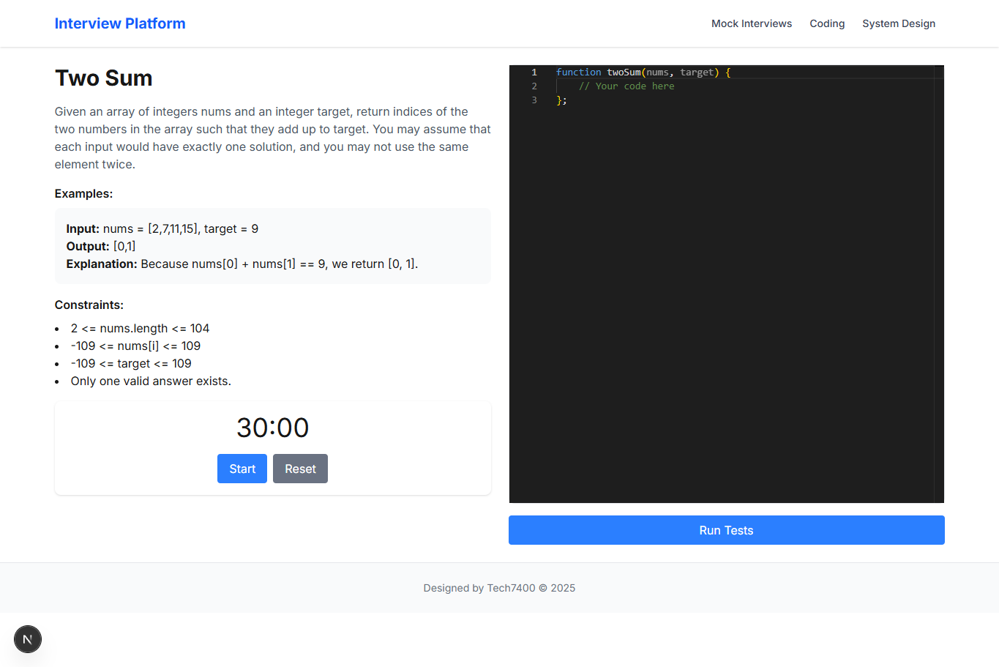
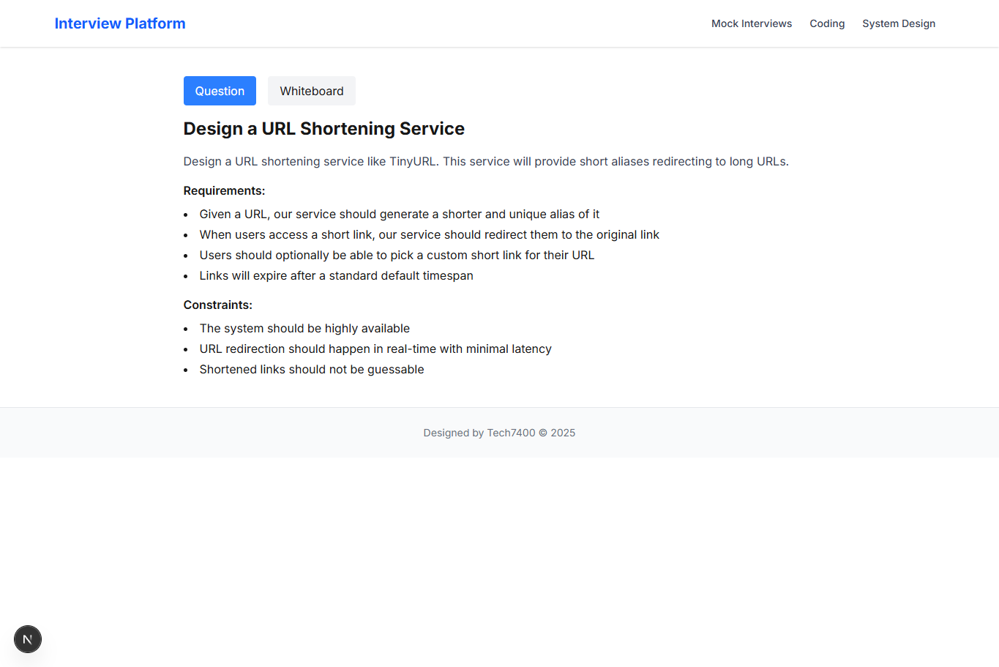

# 🧠 Interview Practice Platform

An advanced full-stack platform to practice **real-time technical interviews** — including live coding, system design, and mock interview scheduling — built with modern web technologies.

## ✨ Live Demo

👉 [https://interview-practice-platform-sigma.vercel.app](https://interview-practice-platform-sigma.vercel.app)

---

## 🚀 Features

- 🎥 **Video Interviews** via WebRTC (`simple-peer`)
- 💻 **Real-time Code Editor** using Monaco Editor
- 🔌 **Live Collaboration** with Socket.IO
- 🗓️ **Schedule Mock Interviews** with flexible time slots
- 🧱 **System Design Practice** with whiteboard-like questions
- ⚙️ Built with **Next.js**, **TypeScript**, **TailwindCSS**

---

## 🧩 Tech Stack

| Category           | Tech Used                           |
|--------------------|--------------------------------------|
| Frontend           | Next.js, TypeScript, TailwindCSS     |
| Code Editor        | Monaco Editor                        |
| Video Call         | WebRTC, simple-peer                  |
| Real-time Comm     | Socket.IO                            |
| State Management   | React Hooks, Context API             |
| Scheduling UI      | Custom Calendar & Time Components    |

---

## 📸 Screenshots

### 💻 Coding Challenge  

### 🧱 System Design  

---

📫 LinkedIn: [Levent E.](https://www.linkedin.com/in/levent-erdost-2b0784201)  
💻 GitHub: [@levo-tech7400](https://github.com/levo-tech7400)

